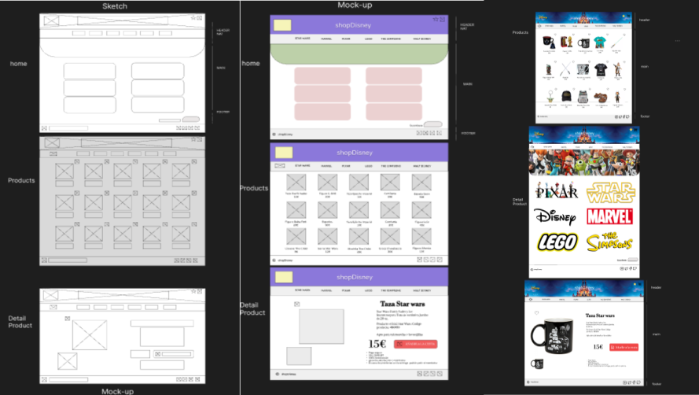

# MyShop :movie_camera:

    

## DESCRIPCIÓN DEL PROYECTO  :mag:

Los CEOs de Disney, Giacomo y María, han solicitado al equipo de desarrollo mejorar la experiencia de comercio electrónico en la página web de Disney. El objetivo es crear una página de inicio de Disney con 6 categorías de la marca.

Al entrar en una de las categorías, los usuarios podrán ver el merchandising y guardar los productos en favoritos.

Por último, al acceder a uno de los productos deseados, aparecerá el producto con su descripción, precio y un botón para añadir al carrito, así como un apartado para guardarlo en favoritos.

## DISEÑO DE LA WEB CON FIGMA

    

 
Nuestra filosofía de trabajo se basa en la colaboración. Hemos utilizado Figma para crear un espacio donde todos los miembros del equipo pueden aportar sus ideas y contribuciones. Cada cambio y revisión se ha realizado de manera conjunta, asegurando que cada decisión sea tomada en consenso.
 
El consenso es clave en nuestro proceso creativo. Hemos valorado todas las opiniones y perspectivas de nuestro equipo, asegurándonos de que cada decisión se tome de manera justa y equitativa. El resultado final es el fruto de nuestro esfuerzo conjunto y compromiso.

## USER FLOW

    

 
Un User Flow es una representación visual y secuencial de las acciones que un usuario realiza en una aplicación o sitio web para lograr un objetivo específico. Estas representaciones muestran el camino que un usuario sigue, desde el inicio de su interacción con la aplicación web hasta la consecución de una tarea o acción deseada. 

## LENGUAJES UTILIZADOS :rocket:

    &nbsp;
    &nbsp;
    &nbsp;
    &nbsp;

## FUNCIONALIDADES DE LA WEB

### Vista principal
1. Menú principal con la BSO de disney pudiendo mutear la canción.
2. Navbar animado con hover.
3. Slider animado con los productos de Disney.
4. Sección de categorías animadas con hover.
5. Botón de Suscríbete con correo electrónico.
6. Footer a las redes sociales.

### Vista Productos
1. 15 Productos animados con hover.
2. Cada producto se podrá dar click en el corazón y almacenar los productos en local storage para consultar más adelante en otra vista.
3. BSO de Star Wars con la opción de mutear la canción.

### Vista detalle del producto
1. El producto se ve con una descripción y el botón de añadir al carrito.
2. El producto se puede cambiar de imagen para ver diferentes posiciones del mismo.
3- El corazón de detalle del producto también tiene la funcionalidad de almacenar en local storage.

### Vista favoritos
1. Todos los productos guardados en favoritos se pueden visualizar correctamente en el caso que se quite algún favorito este desaparecerá de la lista.

## HERRAMIENTAS UTILIZADAS :hammer:

    &nbsp;
    &nbsp;
    &nbsp;

## COLABORADORES/AS  :family:

- [Alicia González](https://github.com/Aliglez)
- [Borja Fernández](https://github.com/BarmanDev)
- [David Colunga](https://github.com/Colunga-D)
- [Eva López](https://github.com/EvaMLopez)
- [Verónica Sampedro](https://github.com/verosampedro)

